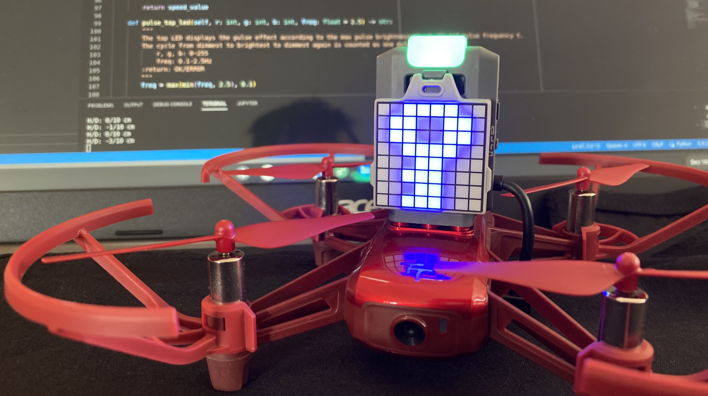

# HelloRoboMaster

[](https://github.com/RichardLitt/standard-readme)

A simple program that connects to a RoboMaster TT Drone and displays a logo on the 8x8 LED matrix. All communication with the drone is through the DJITelloPy module.

## Table of Contents
- [Install](#install)
- [Usage](#usage)
- [Maintainers](#maintainers)
- [Contributing](#contributing)
- [License](#license)

## Install
Download the files to a directory on your computer. The quickest way to do this is using git. Then you must pip install the DJI `djitellopy` module that allows you to easily interface with the RoboMaster TT Drone without having to worry about UDP packets. The DJI module handles this all for you under the hood.

To see the specific compile steps, view the Makefile using a command like `cat Makefile`. The most basic compiling command would something like this:
```
% git clone https://github.com/prof-tallman/HelloRoboMaster
Cloning into 'HelloRoboMaster'...
remote: Enumerating objects: 16, done.
remote: Counting objects: 100% (16/16), done.
remote: Compressing objects: 100% (14/14), done.
remote: Total 16 (delta 5), reused 10 (delta 2), pack-reused 0
Receiving objects: 100% (16/16), 7.26 KiB | 1.82 MiB/s, done.
Resolving deltas: 100% (5/5), done.

% cd HelloRoboMaster

% pip install djitellopy
Collecting djitellopy
  Using cached djitellopy-2.4.0-py3-none-any.whl (14 kB)
Requirement already satisfied: numpy in c:\users\joshua\appdata\local\pack
ages\pythonsoftwarefoundation.python.3.10_qbz5n2kfra8p0\localcache\local-p
ackages\python310\site-packages (from djitellopy) (1.23.5)
Requirement already satisfied: opencv-python in c:\users\joshua\appdata\lo
cal\packages\pythonsoftwarefoundation.python.3.10_qbz5n2kfra8p0\localcache
\local-packages\python310\site-packages (from djitellopy) (4.7.0.68)
Installing collected packages: djitellopy
Successfully installed djitellopy-2.4.0

%
```

Once you have downloaded the files and installed the dependencies (`djitellopy`), grab the drone.
1. Mount the Expansion Kit on top of the Tello Talent like a Lego brick.
1. Then plug the micro USB connector into the side of the drone. The connector is on the opposite side of the power button.
1. Install a fresh battery and turn on the drone. The front lights on the front should flash.

The drone should have created a WiFi access point. You'll need to join this WiFi network from your computer. By default, the AP will be named RMTT-XXXXXX since you have the Expansion Kit attached. If the Expansion Kit were missing, the AP would have been named TELLO-XXXXXX.

You'll need to open two UDP ports on your computer. The first port is probably easiest because it is an outgoing connection from your computer to the drone. Your operating system may prompt you to open the port. But the second port needs to be opened manually because it is an incoming connections from the drone to your computer.
* UDP port 8889
* UDP port 8890

If you would like to know more about the DJI RoboMaster, here is the [User's Manual Local PDF](RoboMaster_TT_Tello_Talent_User_Manual_en.pdf) with lots more information. If you would prefer a web link, here it is on the [DJI website](https://dl.djicdn.com/downloads/RoboMaster+TT/RoboMaster_TT_Tello_Talent_User_Manual_en.pdf).

## Usage
Run the program through the Python3 interpreter. You should see the LEDs on your RoboMaster Drone light up and change colors. The program takes 5-10 seconds to run.
```
% python3 mission_01.py
[INFO] tello.py - 122 - Tello instance was initialized. Host: '192.168.10.1'. Port: '8889'.
Battery: 89%
Temp °F: 47.5
Drone connection closed gracefully
Mission completed

%
```

Your drone should look something along these lines (although I believe this photograph is from an old logo).


## Maintainers
[@JoshuaTallman](https://github.com/prof-tallman)

## Contributing
This program is written as an example for students.

## License
[MIT](LICENSE) © [@JoshuaTallman](https://github.com/prof-tallman)
